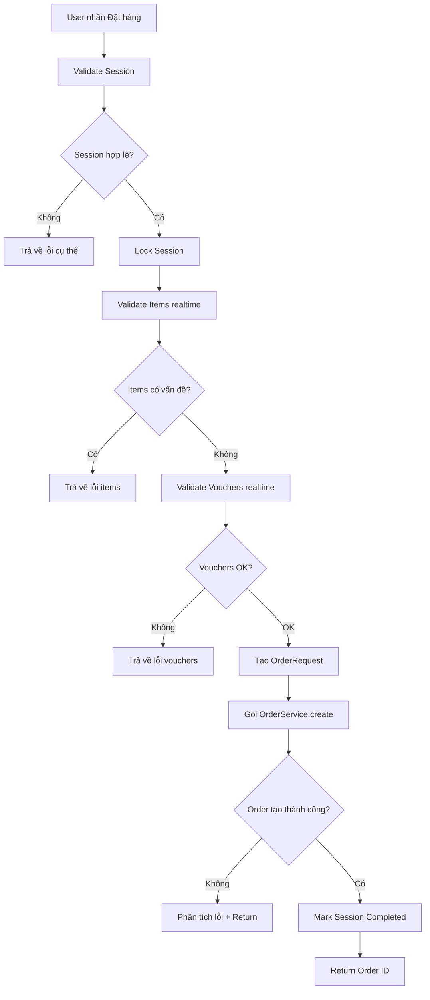

# 🛍️ ORDER CREATION FROM CHECKOUT SESSION - CHI TIẾT LUỒNG MUA HÀNG

## 📌 **TỔNG QUAN**

Document này mô tả chi tiết **luồng mua hàng** từ Checkout Session sang Order, bao gồm tất cả các **edge case thực tế** mà hệ thống phải handle.

---

## 🎯 **LUỒNG MUA HÀNG TỔNG THỂ**



---

## 🔍 **CHI TIẾT CÁC BƯỚC VALIDATION**

### **1. SESSION VALIDATION**

#### **Kiểm tra Session Active:**
```java
if (!session.isActive()) {
    if (session.isExpired()) {
        return "Phiên checkout đã hết hạn. Vui lòng tạo phiên mới.";
    } else {
        return "Phiên checkout không hợp lệ.";
    }
}
```

#### **Kiểm tra địa chỉ giao hàng:**
```java
if (session.getAddress() == null) {
    return "Chưa chọn địa chỉ giao hàng.";
}
```

### **2. ITEMS VALIDATION REALTIME**

#### **Kiểm tra sách tồn tại và status:**
```java
Book book = bookRepository.findById(item.getBookId());
if (book.getStatus() != 1) {
    return "Sách '" + book.getBookName() + "' đã ngừng bán";
}
```

#### **Kiểm tra stock thông thường:**
```java
if (book.getStockQuantity() < item.getQuantity()) {
    return "Sách '" + book.getBookName() + "' chỉ còn " + book.getStockQuantity() + " cuốn trong kho";
}
```

#### **Kiểm tra thay đổi giá (Race condition):**
```java
BigDecimal currentPrice = getCurrentPrice(item);
if (item.getUnitPrice().compareTo(currentPrice) != 0) {
    return "Giá sách '" + book.getBookName() + "' đã thay đổi. Vui lòng cập nhật lại giỏ hàng";
}
```

### **3. FLASH SALE VALIDATION**

#### **Kiểm tra Flash Sale còn active:**
```java
FlashSale flashSale = flashSaleItem.getFlashSale();
long currentTime = System.currentTimeMillis();

if (flashSale.getStatus() != 1) {
    return "Flash sale cho sách '" + book.getBookName() + "' đã bị tắt";
}

if (currentTime > flashSale.getEndTime()) {
    return "Flash sale cho sách '" + book.getBookName() + "' đã kết thúc";
}
```

#### **Kiểm tra stock Flash Sale:**
```java
if (flashSaleItem.getStockQuantity() < item.getQuantity()) {
    return "Flash sale cho sách '" + book.getBookName() + "' chỉ còn " + flashSaleItem.getStockQuantity() + " cuốn";
}
```

### **4. VOUCHER VALIDATION**

#### **Kiểm tra voucher hết hạn đúng lúc đặt hàng:**
```java
long currentTime = System.currentTimeMillis();
if (currentTime > voucher.getEndTime()) {
    return "Voucher '" + voucher.getCode() + "' đã hết hạn";
}
```

#### **Kiểm tra đơn tối thiểu:**
```java
if (voucher.getMinOrderValue() != null && 
    session.getSubtotal().compareTo(voucher.getMinOrderValue()) < 0) {
    return "Voucher '" + voucher.getCode() + "' yêu cầu đơn hàng tối thiểu " + voucher.getMinOrderValue();
}
```

#### **Kiểm tra usage limit:**
```java
if (voucher.getUsageLimit() != null && voucher.getUsedCount() >= voucher.getUsageLimit()) {
    return "Voucher '" + voucher.getCode() + "' đã hết lượt sử dụng";
}
```

---

## ⚠️ **TẤT CẢ EDGE CASES THỰC TẾ**

### **1. RACE CONDITIONS**

#### **Case: 2 user cùng mua item cuối cùng**
- **Giải pháp:** Lock session khi tạo order
- **Behavior:** User đầu thành công, user sau báo hết hàng

#### **Case: Flash sale kết thúc đúng lúc đặt hàng**
- **Detection:** Check `currentTime > flashSale.getEndTime()`
- **Response:** "Flash sale cho sách 'X' đã kết thúc"

#### **Case: Voucher hết hạn trong lúc user đang checkout**
- **Detection:** Check realtime tại thời điểm tạo order
- **Response:** "Voucher 'CODE' đã hết hạn"

### **2. INVENTORY ISSUES**

#### **Case: Sách hết hàng sau khi add vào session**
```java
if (book.getStockQuantity() < item.getQuantity()) {
    return "❌ Sách '" + book.getBookName() + "' chỉ còn " + book.getStockQuantity() + " cuốn trong kho";
}
```

#### **Case: Flash sale hết stock**
```java
if (flashSaleItem.getStockQuantity() < item.getQuantity()) {
    return "❌ Flash sale cho sách '" + book.getBookName() + "' chỉ còn " + flashSaleItem.getStockQuantity() + " cuốn";
}
```

#### **Case: Sách bị ngừng bán đột ngột**
```java
if (book.getStatus() != 1) {
    return "❌ Sách '" + book.getBookName() + "' đã ngừng bán";
}
```

### **3. PRICING ISSUES**

#### **Case: Giá thay đổi giữa session và order**
```java
BigDecimal currentPrice = getCurrentPrice(item);
if (item.getUnitPrice().compareTo(currentPrice) != 0) {
    return "❌ Giá sách '" + book.getBookName() + "' đã thay đổi từ " + item.getUnitPrice() + " thành " + currentPrice;
}
```

#### **Case: Flash sale price thay đổi**
```java
BigDecimal currentFlashPrice = getCurrentFlashSalePrice(item.getFlashSaleItemId());
if (currentFlashPrice == null) {
    return "❌ Flash sale cho sách '" + book.getBookName() + "' đã kết thúc";
}
```

### **4. VOUCHER COMPLEX CASES**

#### **Case: Voucher conflict (1 user, multiple sessions)**
```java
if (!voucherCalculationService.canUserUseVoucher(userId, voucherId)) {
    return "❌ Bạn đã sử dụng hết lượt cho voucher '" + voucher.getCode() + "'";
}
```

#### **Case: Multi-voucher validation**
```java
// Kiểm tra tổng discount có vượt quá max không
// Kiểm tra voucher type conflicts (shipping vs product)
```

#### **Case: Voucher minimum order change**
```java
// Khi user remove items khỏi session → subtotal giảm → voucher không đủ điều kiện
if (session.getSubtotal().compareTo(voucher.getMinOrderValue()) < 0) {
    return "❌ Đơn hàng không đủ điều kiện cho voucher '" + voucher.getCode() + "'";
}
```

### **5. SESSION EXPIRY CASES**

#### **Case: Session hết hạn đúng lúc đặt hàng**
```java
if (session.isExpired()) {
    return "❌ Phiên checkout đã hết hạn. Vui lòng tạo phiên mới.";
}
```

#### **Case: Session bị completed bởi request khác**
```java
if (session.getStatus() == 2) {
    return "❌ Đơn hàng đã được đặt từ phiên này rồi.";
}
```

---

## 🎯 **API ENDPOINT DETAILS**

### **POST /api/checkout-sessions/{sessionId}/create-order**

#### **Request:**
```http
POST /api/checkout-sessions/123/create-order?userId=456
Content-Type: application/json
```

#### **Success Response (201):**
```json
{
  "status": 201,
  "message": "Đặt hàng thành công! Mã đơn hàng: ORD20250711001",
  "data": 12345
}
```

#### **Error Responses:**

**400 - Session Issues:**
```json
{
  "status": 400,
  "message": "❌ Phiên checkout đã hết hạn. Vui lòng tạo phiên mới.",
  "data": null
}
```

**400 - Stock Issues:**
```json
{
  "status": 400,
  "message": "❌ Sách 'Clean Code' chỉ còn 2 cuốn trong kho",
  "data": null
}
```

**400 - Flash Sale Issues:**
```json
{
  "status": 400,
  "message": "❌ Flash sale cho sách 'Spring Boot' đã kết thúc",
  "data": null
}
```

**400 - Voucher Issues:**
```json
{
  "status": 400,
  "message": "❌ Voucher 'WELCOME10' đã hết hạn",
  "data": null
}
```

**400 - Price Change:**
```json
{
  "status": 400,
  "message": "❌ Giá sách 'Java Programming' đã thay đổi. Vui lòng cập nhật lại giỏ hàng",
  "data": null
}
```

**404 - Session Not Found:**
```json
{
  "status": 404,
  "message": "Không tìm thấy checkout session",
  "data": null
}
```

**500 - System Error:**
```json
{
  "status": 500,
  "message": "Lỗi hệ thống khi tạo đơn hàng. Vui lòng thử lại sau.",
  "data": null
}
```

---

## 🔧 **IMPLEMENTATION DETAILS**

### **Synchronization Strategy:**
```java
// Lock session khi tạo order để tránh race condition
synchronized (this) {
    // Double-check session vẫn còn active
    session = getSessionEntity(sessionId, userId);
    if (session == null || !session.isActive()) {
        return new ApiResponse<>(400, "Session đã hết hạn hoặc không khả dụng", null);
    }
    
    // Process order creation...
}
```

### **Error Classification:**
```java
private String analyzeOrderCreationError(String originalError, CheckoutSession session) {
    String lowerError = originalError.toLowerCase();
    
    if (lowerError.contains("stock")) {
        return "❌ Một số sản phẩm đã hết hàng. Vui lòng cập nhật lại giỏ hàng.";
    }
    
    if (lowerError.contains("flash sale")) {
        return "❌ Flash sale đã kết thúc hoặc hết hàng. Vui lòng kiểm tra lại.";
    }
    
    if (lowerError.contains("voucher")) {
        return "❌ Voucher không hợp lệ hoặc đã hết hạn. Vui lòng kiểm tra lại.";
    }
    
    if (lowerError.contains("price")) {
        return "❌ Giá sản phẩm đã thay đổi. Vui lòng cập nhật lại đơn hàng.";
    }
    
    return "❌ " + originalError;
}
```

---

## 🎯 **FRONTEND INTEGRATION**

### **Complete Order Flow:**
```javascript
const handleCreateOrder = async (sessionId, userId) => {
  try {
    // 1. Show loading
    setLoading(true);
    setError(null);
    
    // 2. Validate session trước (optional - để UX tốt hơn)
    const validateResult = await validateSession(sessionId, userId);
    if (validateResult.status !== 200) {
      setError(validateResult.message);
      return;
    }
    
    // 3. Tạo order
    const orderResult = await createOrderFromSession(sessionId, userId);
    
    if (orderResult.status === 201) {
      // Success: Navigate to order success page
      router.push(`/order-success/${orderResult.data}`);
    } else {
      // Error: Show specific error message
      setError(orderResult.message);
      
      // Nếu là lỗi stock/price → redirect về cart để update
      if (orderResult.message.includes('hết hàng') || orderResult.message.includes('thay đổi')) {
        setTimeout(() => {
          router.push('/cart');
        }, 3000);
      }
    }
    
  } catch (error) {
    console.error('Order creation error:', error);
    setError('Lỗi hệ thống. Vui lòng thử lại sau.');
  } finally {
    setLoading(false);
  }
};
```

### **Error Handling Strategy:**
```javascript
const handleOrderError = (errorMessage) => {
  // Phân loại lỗi và xử lý tương ứng
  if (errorMessage.includes('hết hạn')) {
    // Session expired → Tạo session mới từ cart
    showDialog({
      title: 'Phiên hết hạn',
      message: 'Phiên checkout đã hết hạn. Chúng tôi sẽ tạo phiên mới cho bạn.',
      onConfirm: () => createNewSessionFromCart()
    });
  } else if (errorMessage.includes('hết hàng')) {
    // Stock issue → Redirect to cart
    showDialog({
      title: 'Sản phẩm hết hàng',
      message: errorMessage + '\n\nBạn sẽ được chuyển về giỏ hàng để cập nhật.',
      onConfirm: () => router.push('/cart')
    });
  } else if (errorMessage.includes('thay đổi')) {
    // Price change → Refresh session
    showDialog({
      title: 'Giá thay đổi',
      message: errorMessage + '\n\nVui lòng kiểm tra lại đơn hàng.',
      onConfirm: () => refreshSession()
    });
  } else {
    // Generic error
    showError(errorMessage);
  }
};
```

---

## 📊 **MONITORING & ANALYTICS**

### **Key Metrics to Track:**
- Order creation success rate từ checkout session
- Most common validation errors
- Average time from session creation to order
- Session expiry rate vs order conversion

### **Logging Strategy:**
```java
// Log success
log.info("✅ Successfully created order: {} from session: {}", orderId, sessionId);

// Log validation failures
log.warn("Session validation failed for session {}: {}", session.getId(), errorMessage);

// Log critical errors
log.error("💥 Critical error creating order from session: {}", sessionId, e);
```

---

## 🔒 **SECURITY CONSIDERATIONS**

1. **Session Ownership:** Chỉ user sở hữu session mới có thể tạo order
2. **Idempotency:** Tránh duplicate orders từ cùng 1 session
3. **Rate Limiting:** Giới hạn số lần tạo order mỗi user/thời gian
4. **Data Validation:** Validate tất cả dữ liệu từ session trước khi tạo order

---

*📝 Document này cover tất cả các trường hợp thực tế có thể xảy ra trong quá trình mua hàng. Update khi có thêm edge cases mới.*
